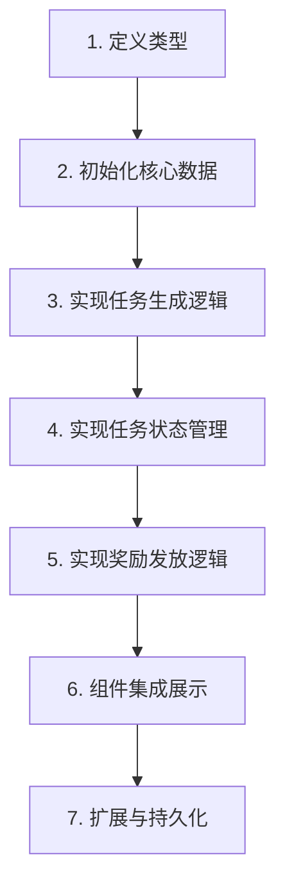

你希望我把之前的任务系统实现方案，转换成一份**执行文档**的形式，重点说明每一步的规划和关键代码片段（而非完整长代码），方便你按步骤落地到自己的 Vue + TS 模拟经营游戏项目中。

这份执行文档会以“步骤化规划”为核心，明确每个阶段的目标、核心思路、关键代码和注意事项，完全适配你的单人前端项目场景。

---

# 模拟经营游戏任务系统 - 前端执行文档
## 文档说明
- 适用项目：Vue 3 + TypeScript 模拟经营游戏（单人、无后端）
- 任务类型：成长任务（等级驱动）、紧急任务（随机）、阶段任务（日期驱动）
- 核心目标：实现任务的生成、进度跟踪、状态管理、奖励发放全流程

## 整体执行流程


## 详细执行步骤

### 步骤 1：定义核心类型（基础准备）
#### 目标
用 TypeScript 明确任务、玩家、奖励等核心数据结构，保证类型安全。
#### 核心思路
- 枚举：任务类型、任务状态（便于统一管理）
- 接口：奖励、基础任务、玩家信息（明确数据字段）
#### 关键代码（片段）
```typescript
// 任务类型枚举
export enum TaskType {
  GROWTH = 'growth', // 成长任务
  EMERGENCY = 'emergency', // 紧急任务
  STAGE = 'stage' // 阶段任务
}

// 任务状态枚举
export enum TaskStatus {
  UNFINISHED = 'unfinished',
  FINISHED = 'finished',
  RECEIVED = 'received'
}

// 基础任务接口（核心字段）
export interface BaseTask {
  id: string;
  name: string;
  type: TaskType;
  status: TaskStatus;
  rewards: { type: string; count: number }[]; // 奖励
  condition: { target: string; value: number; current: number }; // 完成条件
  extra?: { level?: number; triggerDay?: number; expireTime?: number }; // 扩展字段
}
```
#### 注意事项
- 扩展字段根据不同任务类型按需添加（如紧急任务加过期时间，成长任务加触发等级）
- 奖励类型可根据游戏实际玩法扩展（如 `coin`/`diamond`/`item`）

### 步骤 2：初始化核心响应式数据
#### 目标
创建玩家信息、任务列表等响应式数据，作为任务系统的数据源。
#### 核心思路
- 使用 Vue 的 `ref` 定义响应式数据
- 预设任务模板库（存储各类任务的基础配置）
#### 关键代码（片段）
```typescript
import { ref } from 'vue';

// 玩家信息（响应式）
export const playerInfo = ref({
  level: 1, // 当前等级
  day: 1, // 当前游戏天数
  coins: 1000 // 金币等资源
});

// 任务列表（响应式）
export const taskList = ref<BaseTask[]>([]);

// 任务模板库（预设各类任务配置）
const taskTemplates = {
  growthTasks: [{ id: 'growth_1', name: '升级到2级', ... }], // 成长任务模板
  stageTasks: [{ id: 'stage_1', name: '首日营业', ... }], // 阶段任务模板
  emergencyTasks: [{ id: 'emergency_1', name: '紧急补货', ... }] // 紧急任务模板
};
```
#### 注意事项
- 模板库仅存储基础配置，实际任务从模板生成后加入 `taskList`
- 玩家信息需和游戏现有逻辑联动（如等级升级、天数推进）

### 步骤 3：实现三类任务的生成逻辑
#### 目标
分别实现成长、阶段、紧急任务的生成规则，确保任务按需触发。
#### 核心思路
- 成长任务：根据玩家等级触发
- 阶段任务：根据游戏天数触发
- 紧急任务：随机概率生成，带过期时间
#### 关键代码（片段）
```typescript
// 1. 成长任务生成（等级驱动）
const generateGrowthTasks = () => {
  const eligibleTasks = taskTemplates.growthTasks.filter(
    task => task.extra?.level <= playerInfo.value.level && !taskList.value.some(t => t.id === task.id)
  );
  taskList.value.push(...eligibleTasks);
};

// 2. 阶段任务生成（天数驱动）
const generateStageTasks = () => {
  const eligibleTasks = taskTemplates.stageTasks.filter(
    task => task.extra?.triggerDay === playerInfo.value.day && !taskList.value.some(t => t.id === task.id)
  );
  taskList.value.push(...eligibleTasks);
};

// 3. 紧急任务生成（随机）
export const generateEmergencyTask = () => {
  if (Math.random() > 0.5) return; // 50%概率生成
  const selectedTask = taskTemplates.emergencyTasks[Math.floor(Math.random() * taskTemplates.emergencyTasks.length)];
  taskList.value.push({ ...selectedTask, extra: { ...selectedTask.extra, expireTime: Date.now() + 3600 * 1000 } });
};
```
#### 注意事项
- 成长/阶段任务需避免重复生成（通过 ID 过滤）
- 紧急任务需设置过期时间，后续需定时检查过期

### 步骤 4：实现任务状态与进度管理
#### 目标
统一处理任务进度更新、状态变更、过期检查。
#### 核心思路
- 进度更新：根据游戏行为（如升级、营业）同步任务进度
- 状态变更：进度达标后标记为“可领奖”
- 过期检查：定时清理过期的紧急任务
#### 关键代码（片段）
```typescript
// 更新任务进度（核心方法）
export const updateTaskProgress = (target: string, value: number) => {
  taskList.value.forEach(task => {
    if (task.status === TaskStatus.UNFINISHED && task.condition.target === target) {
      task.condition.current = value;
      // 进度达标，标记为可领奖
      if (task.condition.current >= task.condition.value) {
        task.status = TaskStatus.FINISHED;
      }
    }
  });
};

// 检查紧急任务过期
export const checkExpiredEmergencyTasks = () => {
  const now = Date.now();
  taskList.value = taskList.value.filter(task => {
    // 仅保留未过期的紧急任务
    return !(task.type === TaskType.EMERGENCY && task.extra?.expireTime < now && task.status === TaskStatus.UNFINISHED);
  });
};
```
#### 注意事项
- `updateTaskProgress` 需在游戏核心行为触发时调用（如玩家升级、完成营业）
- 过期检查建议定时执行（如每小时一次）

### 步骤 5：实现奖励发放逻辑
#### 目标
完成任务后发放奖励，并更新任务状态为“已领奖”。
#### 核心思路
- 校验任务状态（仅“可领奖”任务可发放）
- 按奖励类型更新玩家资源
- 发放后标记任务为“已领奖”
#### 关键代码（片段）
```typescript
export const receiveTaskReward = (taskId: string) => {
  const task = taskList.value.find(t => t.id === taskId);
  if (!task || task.status !== TaskStatus.FINISHED) return false;

  // 发放奖励
  task.rewards.forEach(reward => {
    switch (reward.type) {
      case 'coin': playerInfo.value.coins += reward.count; break;
      case 'exp': playerInfo.value.exp += reward.count; break;
      // 其他奖励类型（钻石/道具）按需扩展
    }
  });

  // 更新任务状态
  task.status = TaskStatus.RECEIVED;
  return true;
};
```
#### 注意事项
- 奖励发放需做状态校验，避免重复领奖
- 道具类奖励需结合游戏道具系统扩展

### 步骤 6：组件集成与展示
#### 目标
在 Vue 组件中展示任务列表，实现交互（查看进度、领取奖励）。
#### 核心思路
- 按任务类型筛选展示
- 绑定任务状态和进度，提供“领取奖励”按钮
- 关联游戏操作（如测试升级、推进天数）
#### 关键代码（片段）
```vue
<template>
  <!-- 成长任务展示 -->
  <div v-for="task in filteredGrowthTasks" :key="task.id">
    <p>{{ task.name }}：{{ task.condition.current }}/{{ task.condition.value }}</p>
    <button @click="receiveTaskReward(task.id)" v-if="task.status === 'finished'">
      领取奖励
    </button>
  </div>
</template>

<script setup lang="ts">
import { computed } from 'vue';
// 按类型筛选任务
const filteredGrowthTasks = computed(() => taskList.value.filter(t => t.type === TaskType.GROWTH));
</script>
```
#### 注意事项
- 组件仅负责展示和交互，核心逻辑仍调用 `taskSystem.ts` 中的方法
- 样式可根据游戏UI风格自定义，无需改动核心逻辑

### 步骤 7：扩展与数据持久化（可选）
#### 目标
保证刷新页面后任务数据不丢失，扩展更多任务玩法。
#### 核心思路
- 本地存储：将 `playerInfo` 和 `taskList` 存入 `localStorage`
- 初始化时读取存储数据，更新时同步存储
#### 关键代码（片段）
```typescript
// 数据持久化 - 保存到 localStorage
const saveToLocal = () => {
  localStorage.setItem('playerInfo', JSON.stringify(playerInfo.value));
  localStorage.setItem('taskList', JSON.stringify(taskList.value));
};

// 数据持久化 - 从 localStorage 读取
const loadFromLocal = () => {
  const savedPlayer = localStorage.getItem('playerInfo');
  const savedTasks = localStorage.getItem('taskList');
  if (savedPlayer) playerInfo.value = JSON.parse(savedPlayer);
  if (savedTasks) taskList.value = JSON.parse(savedTasks);
};

// 初始化时加载数据
export const initTaskSystem = () => {
  loadFromLocal();
  generateGrowthTasks();
  generateStageTasks();
  // 定时保存数据（如每分钟一次）
  setInterval(saveToLocal, 60 * 1000);
};
```
#### 注意事项
- 存储前需序列化数据，读取后需反序列化
- 定时保存或在关键操作后保存（如领奖、升级）

## 总结
1. 任务系统核心分为“类型定义→数据初始化→任务生成→状态管理→奖励发放→组件展示”六步，按顺序落地即可完成基础功能。
2. 关键代码聚焦核心逻辑（如任务生成、进度更新、奖励发放），无需编写长代码，可直接适配你的游戏现有逻辑。
3. 数据持久化是可选但重要的扩展步骤，能保证玩家数据不丢失，提升体验。

你可按照这份文档的步骤，先完成基础的类型定义和核心逻辑，再逐步集成到组件中，最后根据游戏玩法扩展任务模板和奖励类型。如果某一步需要更具体的思路（如如何联动游戏现有等级系统），可以随时告诉我。